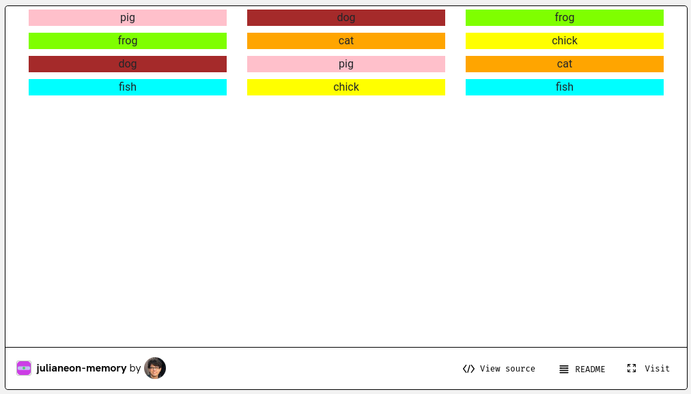

# Memory Game

## Demo

You can see a live version of this app on its [Glitch page](https://glitch.com/~julianeon-memory). Be warned it may take 1-3 minutes to load.

## About

This is a memory app card game made using React, hooks, and the spread operator. 

I tried to find a very simple memory game made in React online and couldn't - many of them were written before the advent of hooks. 

This one is about as minimally complicated as it can be, for its functionality.

It uses a state variable that remembers the last item chosen, and its position. 

## How It Works

Upon selection of an item, the code checks: Is this the same name as the last one - and if so, is it in the same position? (You don't want that because then you could just click on the same item, twice).

If it has the same name as the last chosen item and it's in a different position, it's a match. In that case it's put it in the 'show' array. 

Whenever items are rendered, they're gray if they're not in that array, and shown permanently in their actual colors if they are in it (that would be everything in the 'show' array).

Example: you remember where the pig is - upper left corner, bottom right corner - and you click those two consecutively. That's a match, that's the win condition for the memory game. (In the implementation, that means the title of the current item matches the item name stored from the last click, and it's in a different position). 

So that item is shown from now on, whenever you do that - and so on, until every pair on the board is shown.

The exception to everything not in 'show' being gray is the item you just clicked on, which appears for 1 second. 

That's the reason for the 3-branch test condition in the code (basically, you clicked on it so show it for a second; it's supposed to be permanently shown; or, it's unknown and in gray).

## Ideas for Improvement

It would be better if there was an array of choices - say, ["dog","cat","bird","fish"] - and the app randomly inserted them into the 3x4 display.

Also, it would be even better if instead of being represented by a name, there was instead an image showing the animal (ideally an SVG so it would be responsive).
